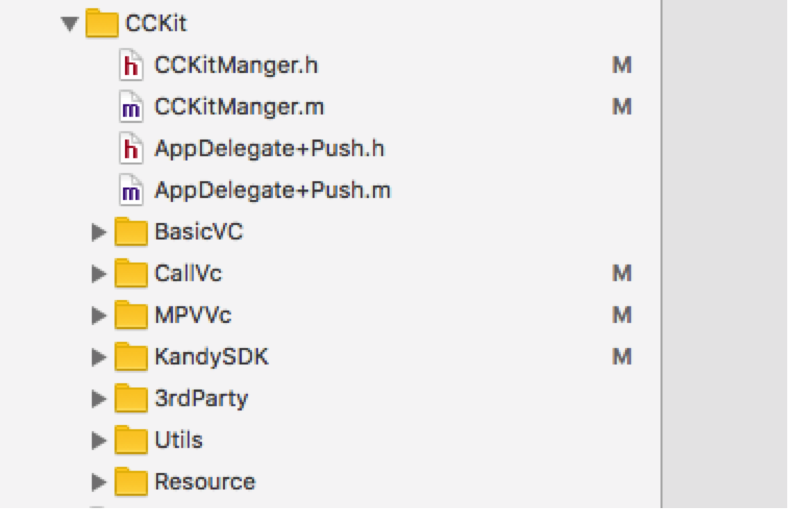
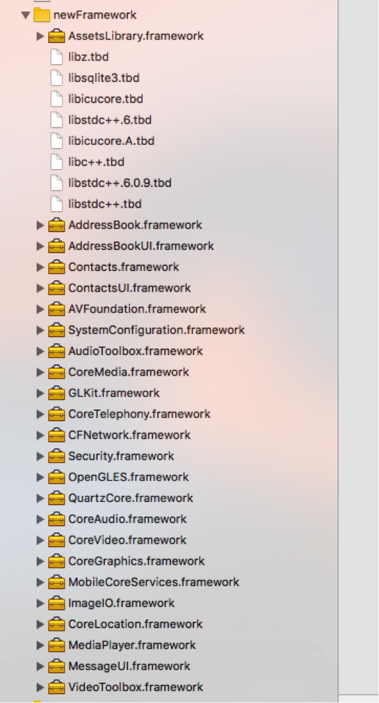
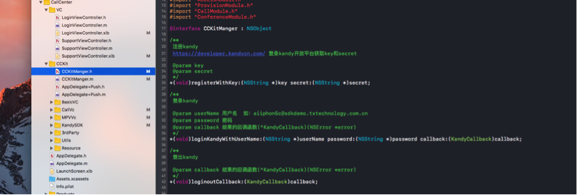

# SDKDemo 快速集成文档【IOS】

## 集成步骤

### 添加代码

将CCKit 目录的代码都copy 到自己的工程中 
CallVc 是Call业务处理目录 
MPVVc是MPV业务处理目录 

### 添加.a 库

将如上的.a 文件应用到工程中

### 代码调用
CCKitManger.h 是SDKDemo 对外调用的函数合集，完成Call和MPV 的功能封装。在supportViewController 完成对其调用的方式。
#### 设置appid 和 appsecert 初始化kandySDK

在Appdelegate.m中

#### 用户登录
参考LoginViewController 
` 
[Utils showHUDOnWindowWithText:@"正在登录.."];  
[CCKitManger loginKandyWithUserName:self.phoneTextField.text
               password:self.smsTextField.text
                               callback:^(NSError *error) {  
          [Utils hideHUDForWindow];  
           if (error) {  
             [self.view makeToast:[error description]];  
           }else{  
             [self.navigationController popViewControllerAnimated:YES];  
       [self.navigationController setNavigationBarHidden:NO];  
  }
}];`

#### 拨打call
参考SupportViewController 
`[CCKitManger
     callWithIsPstn:NO
     isWithVideo:self.switchVideo.isOn
     callee:self.iphoneTxt.text
     callback:^(NSError *error) {
         dispatch_async(dispatch_get_main_queue(), ^{
             if (!error) {
                 CCCallViewController *cccall = [[CCCallViewController alloc] initWithNibName:@"CCCallViewController" bundle:nil];
                 [self.navigationController presentViewController:cccall animated:YES completion:NULL];
             }else{
             }
         });
}];`

#### 发起MPV 会议
参考SupportViewController 
`CCMPVRoomListViewController *cccall = [[CCMPVRoomListViewController alloc] initWithNibName:@"CCMPVRoomListViewController" bundle:nil];
[self.navigationController pushViewController:cccall animated:YES];`

### 推送
本推送是采用IOS的VOIP push 为推送消息载体，故要求sdk running ios8+
关于voip push：[http://blog.csdn.net/openglnewbee/article/details/44807191](http://blog.csdn.net/openglnewbee/article/details/44807191)  
将voip 证书转化格式：
[https://blog.serverdensity.com/how-to-renew-your-apple-push-notification-push-ssl-certificate/](https://blog.serverdensity.com/how-to-renew-your-apple-push-notification-push-ssl-certificate/)

邮件发送给我们，我们帮你维护到后台系统中。

